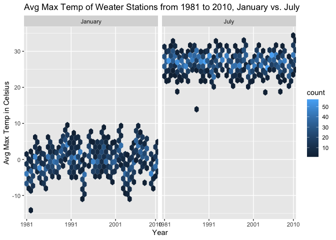
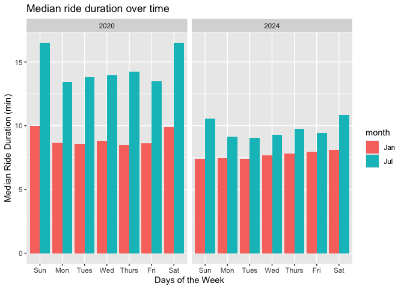
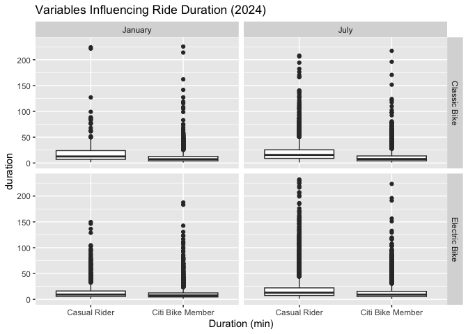
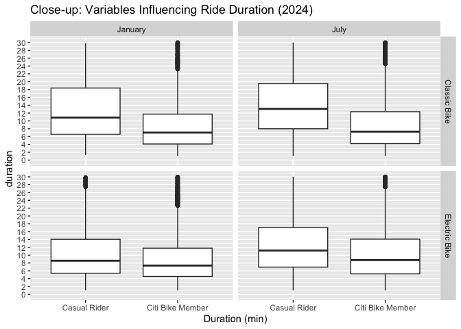

Homework 3
================
10/16/2024 (Due date)

\_Note: This homework assignment used the following libraries:
`tidyverse`, `ggridges`, `patchwork`, and `p8105.datasets`.

## Problem 1

**Dataset Description**

The `ny_noaa` dataset, which was uploaded from the *p8105.dataset*
package, contains 7 variables and 2595176 observations with data from
747 unique NYC weather stations. Character variables include weather
station ID (`id`), maximum temperature (`tmax`), and minmum temperature
(`tmin`). Both temperature variables are measured in tenths of degrees
Celsius. Integer variables include precipitation in tenths of mm
(`prcp`), snowfall in mm (`snow`), and snow depth in mm (`snwd`). There
is also a `date` variable, which is entered in YYYY-MM-DD format. After
viewing the variable types in the dataset, I converted `tmax` and `tmin`
into doubles. Using `summary()`, we get the following information:

``` r
ny_noaa = ny_noaa |>
  mutate(
    tmax = as.double(tmax),
    tmin = as.double(tmin))

summary(ny_noaa)
```

    ##       id                 date                 prcp               snow       
    ##  Length:2595176     Min.   :1981-01-01   Min.   :    0.00   Min.   :  -13   
    ##  Class :character   1st Qu.:1988-11-29   1st Qu.:    0.00   1st Qu.:    0   
    ##  Mode  :character   Median :1997-01-21   Median :    0.00   Median :    0   
    ##                     Mean   :1997-01-01   Mean   :   29.82   Mean   :    5   
    ##                     3rd Qu.:2005-09-01   3rd Qu.:   23.00   3rd Qu.:    0   
    ##                     Max.   :2010-12-31   Max.   :22860.00   Max.   :10160   
    ##                                          NA's   :145838     NA's   :381221  
    ##       snwd             tmax              tmin        
    ##  Min.   :   0.0   Min.   :-389.0    Min.   :-594.0   
    ##  1st Qu.:   0.0   1st Qu.:  50.0    1st Qu.: -39.0   
    ##  Median :   0.0   Median : 150.0    Median :  33.0   
    ##  Mean   :  37.3   Mean   : 139.8    Mean   :  30.3   
    ##  3rd Qu.:   0.0   3rd Qu.: 233.0    3rd Qu.: 111.0   
    ##  Max.   :9195.0   Max.   : 600.0    Max.   : 600.0   
    ##  NA's   :591786   NA's   :1134358   NA's   :1134420

As you can see, there are a number of entries with missing values (NA)
for the variables above. Thus, missing data is quite an issue in this
dataset.

- `prcp`: 145838 NA entries
- `snow`: 381221 NA entries
- `snwd`: 591786 NA entries  
- `tmax`: 1132358 NA entries
- `tmin`: 1134420 NA entries

#### Task 1:

``` r
ny_noaa = ny_noaa |>
   separate(date, into = c("year", "month", "day"), sep = "-") |>
  mutate(
    tmax = tmax/10, #changed units of temperature to °C
    tmin = tmin/10, #changed units of temperature to °C
    prcp = prcp/10) #changed units of temperature to mm
```

In the dataset, I created 3 additional date variables by splitting
`date` into `year`, `month`, and `day`.

To ensure observations for temperature, precipitation, and snowfall are
given in reasonable units, I converted the values in `tmax` and `tmin`
to have °C as the units (instead of tenths of °C). Similarly, the unit
for precipitation (`prcp`) has been converted to just mm. Snowfall is in
reasonable units (mm).

For snowfall (`snow`), the top 3 most commonly observed values are 0mm
(77.39%, n=2008508), 25mm (1.20%, n=31022), and 13mm (0.89%, n=23095).
It may be important to note that 14.69% of the observations had NAs
(n=381221).

The relatively high percentage of empty observations for snowfall is due
to inconsistent data collection of each weather station. Some of these
weather stations may collect a portion of the variables. In general, it
makes sense that most of the observations recorded by the New York state
weather stations had 0mm for snow since the data is collected from the
time period between January 1, 1981 through December 31, 2010 and not
just during winter months.

#### Task 2

<!-- -->

There seem to be a few outliers in the January and July plots. For
example, in January 1982, there is a data point that is less than -10
degrees C. In January 2008, there is another outlier with an average max
temp of \< -5 degrees C. For the July plot, we see more outliers than in
the January plot. In particular, in July of 1988, there is an outlier
with an average max temperature that is less than 15 degrees C.

<!-- --> Using the
function `geom_hex()`, we see that the average max temperature in July
seems to be fairly consistent among the weather stations across the
years from 1981 to 2010 with a few outliers. For the January plot, we
see more variation.

#### Task 3

<!-- -->
The plot on the left shows the distribution of minimum temperature and
maximum temperature for the entire dataset.

The plot on the right shows the distribution of snowfall in mm across
the years from 1981 to 2010. Outliers can be seen for snowfall greater
than 0mm.

## Problem 2

#### Task 1

*“nhanes_covar.csv”* has been uploaded as the `demo_df` dataset. Using
`summary()`, we see that there are 4 NAs for BMI and 18 NAs for
education. All 5 variables are numeric (`SEQN`, `sex`, `age`, `BMI` and
`Education`. There are 250 unique SEQNs, one for each participant.

*“nhanes_accel.csv”* has been uploaded as the `accel_df` dataset. There
are 250 SEQNs, which reflects those that are in the `demo_df` dataset.
All 1441 variables are numeric (dbl). Measurements are collected for
`min1` to `min1440`.

The two dataset are then merged into the `merged_df` dataset, which
contains all orignially observed variables. Participants less than 21
years old and those with missing demographic data (those with NAs for
BMI and education, as mentioned above) are excluded. `SEQN`, `sex`, and
`education` are converted into factors in preparation for generating
tables and plots.

#### Task 2

**Number of Men vs. Women per Education Category**

| Education              | Female | Male |
|:-----------------------|-------:|-----:|
| High school equivalent |     23 |   35 |
| Less than high school  |     28 |   27 |
| More than high school  |     59 |   56 |

- At the “High school equivalent” level, there are more males than
  females by 12 individuals.
- At the “Less than high school” level, the numbers are similar, with
  females higher by one individual.
- At the “More than high school” level, females are higher in number by
  3 individuals.

**Age Distributions for Men vs. Women per Education Category**

<!-- -->

- At the “High school equivalent” level, females have a higher age
  average when compared to males.
- At the “Less than high school” level, the average age is similar
  between male and females, with females having a slightly higher
  average age.
- At the “More than high school” level, the average age is higher in
  males when compared to females.

#### Task 3

Since traditional analyses of accelerometer data focus on the total
activity over the day, values in `min1` through `min1440` for each
participant was summed into the variable `total_activity`. This was done
by grouping `SEQN`, `sex`, `age`, `BMI`, and `education`.

<!-- -->

Looking at the plot above, we see some similarities and differences
between female and male total activity distribution across age at each
education level.

- At the “High school equivalent” level, females have higher total
  activity across different ages compared to males. Total activity for
  female peaked around age 40 then declined with increased age. A small
  increase is seen around age 70. Males also follow a similar trend,
  peaking around 40 years then declining to a plateau.
- At the “Less than high school” level, total activity was higher in
  females compared to males before 40 years of age. Afterwards, males
  had higher total activity, peaking at age 60 years old.
- At the “More than high school” level, females generally have higher
  total activity compared to males. Both genders experience a general
  decline in total activity between 50-60 years old.

#### Task 4

<!-- -->

Over the course of day, we see that the the 24-hour activity time
pattern is similar between those with high school equivalent and less
than high school education levels. For those with more than high school
education, females have slightly higher total activity levels compared
to male. The trend lines for each education level shows similarities
between females and males.

## Problem 3

#### Task 1

4 Citi Bike datasets have been uploaded for this question. All 4
datasets have the same 7 variables. Variable names are already in snake
case format. There are 6 character variables = `ride_id`,
`rideable_type`, `weekdays`, `start_station_name`, `end_station_name`,
and `member_casual`. `Duration` is a numeric variable.

- `Jan2020_df` (12420 rows x 8 columns)
- `July2020_df` (21048 rows x 8 columns)
- `Jan2024_df` (18861 rows x 8 columns)
- `July2024_df` (47156 rows x 8 columns)

Before merging, `year_month` variable is created for each individual
dataset. After merging the 4 datasets, the resulting data is stored in
`merged_bikes` (99485 rows x 8 columns). Data for each entry of
`ride_id` include:

- `rideable_type` include classic nike or electric bike
- `weekdays` range from Monday to Sunday
- `duration` ranges from 1.002 to 238.78 with a mean of 13.93.
- `start_station_name` contains 2241 distinct names, 43 entries were
  NAs.
- `end_station_name` contains 2253 distinct names, 207 entries were NAs.
- `member_casual` include casual and member
- `year_month` variable identifies by Month and the corresponding Year

#### Task 2

**Total number of rides by Casual riders and Citi Bike members**

| Casual rider or Citi Bike member | Jan 2020 | July 2020 | Jan 2024 | July 2024 |
|:---------------------------------|---------:|----------:|---------:|----------:|
| casual                           |      984 |      5637 |     2108 |     10894 |
| member                           |    11436 |     15411 |    16753 |     36262 |
| Total                            |    12420 |     21048 |    18861 |     47156 |

Citi Bike members make a larger proportion of the total rides for all 4
month-year combination. In the month of July for both 2020 and 2024,
there is a higher number of rides compared to the month of January in
those years. In this table, the highest total number of rides is in July
2024. The lowest number of rides is in January 2020. There are more
rides in 2024 than in 2020, January and July rides combined.

#### Task 3

**Top 5 Most Popular Starting Stations for July 2024**

| Starting Station         | Number of Rides From This Station |
|:-------------------------|----------------------------------:|
| Pier 61 at Chelsea Piers |                               163 |
| University Pl & E 14 St  |                               155 |
| W 21 St & 6 Ave          |                               152 |
| West St & Chambers St    |                               150 |
| W 31 St & 7 Ave          |                               146 |

The table above shows 5 stations that were most popular in July 2024.
The number of rides that originated from each of the stations is listed
in the table.

#### Task 4

<!-- -->

In 2020, median ride duration in January was below 10 minutes for all
days of the week. Median ride duration in July are higher than in
January, with values above 15 minutes for Sunday and Saturday. Weekends
have higher median ride duration for both months in 2020 compared to
weekdays.

Median ride duration in January 2024 is lower than in January 2020. The
median ride duration is also much lower in July 2024 than in July 2020.
Weekends in July 2024 have a higher median ride duration compared to
weekdays. For January 2024, there is a slight increase in the median
from Tuesday to Saturday.

There is a smaller difference between the two months across all days of
the week in 2024. Whereas in 2020, we see a greater difference.

#### Task 5

The figure above shows the impact of month, membership status, and bike
type on the distribution of ride duration.

``` r
# month, member_casual, rideable_type, duration
BOX_plot = ggplot(plot_setup, aes(y = duration, x = Membership)) +
  geom_boxplot() +
  facet_grid(rideable_type ~ month) +
      labs(title = "Variables Influencing Ride Duration (2024)",
       x = "Duration (min)")

BOX_plot
```

<!-- -->

``` r
box_closeup = 
  ggplot(plot_setup, aes(y = duration, x = Membership)) +
  geom_boxplot() +
      scale_y_continuous(
      limits = c(0, 30),
    breaks = seq(0, 30, by = 2)) +
  facet_grid(rideable_type ~ month) +
      labs(title = "Close-up: Variables Influencing Ride Duration (2024)",
       x = "Duration (min)")

box_closeup
```

    ## Warning: Removed 4517 rows containing non-finite outside the scale range
    ## (`stat_boxplot()`).

<!-- -->

Looking at all 4 panels of the figure, we see that the distribution of
ride duration is skewed. When stratified by membership status, the bulk
of the data falls in the 4 minutes to 20 minutes range for Classic Bikes
users and in the 4 minutes to 17 minutes range for Electric Bike users.
Looking at the close-up figure, we see that casual riders have a higher
mean ride duration than Citi Bike members in all four panels.

Among those who used the classic bike, casual riders have a higher mean
duration than Citi Bike members for both January and July. Among those
who used the electric bike, this is also true.

Among casual riders who used the classic bike, mean duration is higher
in July than in January. This is also seen for casual riders who used
the electric bike.

Among Citi Bike members who used the classic bike, mean duration is
similar between the two months. When electric bike is used, the mean is
slightly higher in July.

In general, mean duration is higher in July, when the classic bike is
used, for casual riders.
